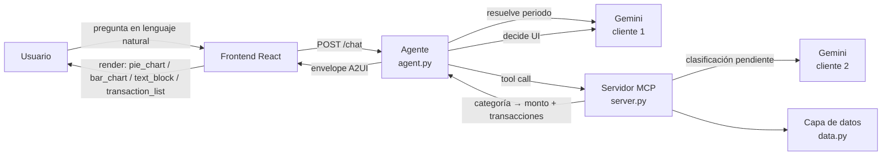

# Arquitectura — Control de Gasto por Categoría

## Visión general

Un agente (LLM) interpreta la intención del usuario en lenguaje natural,
usa un servidor MCP para obtener y agregar datos financieros, y responde
con una interfaz descrita en un protocolo propio tipo A2UI — nunca texto
plano. El frontend no decide nada de negocio: solo sabe pintar los tipos de
componente que el agente le manda.



## Las tres piezas no negociables

1. **LLM al centro** (`backend/agent.py`): interpreta la pregunta, resuelve
   el rango de fechas, y decide qué componente de UI usar con los datos ya
   agregados en mano. Nunca clasifica transacciones ni hace aritmética de
   dinero — eso vive en la capa de datos, no en el prompt.
2. **MCP para datos y acciones** (`backend/mcp_server/`): el agente nunca
   toca una transacción directamente. Todo pasa por dos tools registradas
   en un servidor MCP (`obtener_gasto_por_categoria`,
   `crear_limite_gasto`), que son wrappers finos sobre la capa de datos —
   sin lógica de negocio propia en el servidor.
3. **Protocolo de UI tipo A2UI**: el agente responde con un "envelope" JSON
   (`{version, intent, conversation_id, components}`) donde cada
   `component` tiene un `type` de un catálogo cerrado
   (`pie_chart`, `bar_chart`, `transaction_list`, `text_block`, entre
   otros). El frontend resuelve `type` contra un registry de componentes
   React — agregar un componente nuevo no requiere cambiar el contrato,
   solo registrar el nuevo `type`.

## Flujo de una consulta, paso a paso

1. El usuario pregunta algo como "¿en qué gasté más este mes?". El agente
   interpreta el rango de fechas en lenguaje natural (una llamada a Gemini
   con salida JSON estructurada, sin tools).
2. El agente aplica un tope máximo de 3 meses hacia atrás **en código
   Python**, no confiando esa aritmética al LLM — evita que una
   interpretación creativa del modelo rompa la regla de negocio.
3. El agente llama la tool MCP `obtener_gasto_por_categoria` con el rango
   ya acotado. El servidor MCP:
   - Genera/trae las transacciones crudas del rango (hoy sintéticas,
     deterministas por fecha — ver "Capa de datos" abajo).
   - Excluye movimientos que no son gasto discrecional (retiros,
     transferencias, depósitos, comisiones) **antes** de clasificar — nunca
     cuentan como "Otros".
   - Clasifica cada comercio único por capas (ver siguiente sección).
   - Agrega todo por categoría: `{categoria: {monto_total, transacciones}}`,
     con la lista completa de transacciones ya anidada.
4. El agente recibe el agregado, le pide a Gemini (segunda llamada,
   estructurada, sin la lista de transacciones para no gastar tokens) que
   decida entre `pie_chart` o `bar_chart` y escriba un mensaje breve.
5. El agente traduce el resultado a un envelope A2UI en inglés (el
   contrato interno de clasificación vive en español; la traducción pasa
   en esta frontera) y lo regresa al frontend.
6. El frontend renderiza. El click en una categoría expande sus
   transacciones **sin ninguna llamada de red nueva** — ya vinieron
   anidadas desde el paso 3. Es el punto más visible de una demo en vivo,
   así que es also el que menos debe depender de algo que pueda fallar.

Aparte de esta consulta (de solo lectura), existe una acción independiente
que sí modifica estado: crear un límite de gasto en una categoría, vía la
tool MCP `crear_limite_gasto`.

## Clasificación por capas

En vez de mandar cada transacción al LLM, la clasificación se resuelve en
capas, de más barata/rápida a más cara:

```
comercio → ¿diccionario de cadenas conocidas? ──sí──► categoría
              │no
              ▼
         ¿palabra genérica del nombre del negocio? ──sí──► categoría
              │no
              ▼
         ¿ya está en caché de corridas anteriores? ──sí──► categoría
              │no
              ▼
         batch a Gemini (una sola llamada con TODOS
         los conceptos pendientes, nunca uno por transacción)
              │
              ▼
         ¿categoría válida en la respuesta? ──sí──► categoría (se cachea)
              │no
              ▼
         "Otros" (red de seguridad final)
```

- **Diccionario de cadenas conocidas**: comercios enumerables por nombre
  exacto (Walmart → Despensa, Netflix → Entretenimiento/Suscripciones).
- **Palabras genéricas**: substrings que indican el tipo de negocio
  ("TAQUERIA", "FARMACIA", "CONSULTORIO") — cubren comercios independientes
  no enumerables, mientras su nombre incluya una palabra reveladora.
- **Caché persistente** (JSON en disco): una vez resuelto un comercio por
  el LLM, nunca se le vuelve a preguntar.
- **Fallback a LLM**: solo para lo que de verdad lo necesita — negocios
  independientes con nombres 100% estilizados, sin ninguna palabra
  genérica. Con el dataset sintético actual, el diccionario + palabras
  genéricas cubren el 100% de los comercios — el fallback existe para
  datos reales, no porque el dataset de demo lo necesite.
- **"Otros"**: red de seguridad si el LLM no resuelve o devuelve algo fuera
  de las categorías válidas.

Esto minimiza costo, latencia, y puntos de falla: la herramienta cara (el
LLM) solo se usa donde realmente generaliza algo que un diccionario no
puede.

## Por qué dos clientes de Gemini, no uno

El agente (`agent.py`) y el servidor MCP (`server.py`) son **procesos
separados**, conectados por MCP sobre stdio — el protocolo solo pasa
argumentos serializables entre ellos, no funciones de Python. La función de
clasificación por LLM (`llm_classify_fn`) se inyecta en la capa de
clasificación, pero tiene que construirse **dentro del proceso que la
ejecuta** — que es el servidor MCP, no el agente. Por eso hay dos clientes
de Gemini independientes, cada uno con su propia llamada estructurada:

- `agent.py`: resuelve el periodo en lenguaje natural y decide el tipo de
  componente de UI.
- `server.py`: resuelve comercios que el diccionario no cubre.

No es duplicación accidental — es consecuencia directa de que MCP separa
procesos, y cada proceso que necesita al LLM se lo pide por su cuenta.

## Capa de datos aislada y reemplazable

El proyecto no tiene acceso a una API real de Banorte ni tiempo para
integrar un proveedor de Open Finance (Belvo, Finerio) en el tiempo de un
hackathon. En vez de fingir una conexión real, la arquitectura es honesta
sobre esto y queda lista para el cambio: toda la fuente de datos vive en
un solo módulo (`mcp_server/data.py`) que expone dos funciones
(`obtener_transacciones`, `crear_limite_gasto`) — el resto del sistema no
sabe ni le importa si los datos son sintéticos o reales. Cambiar a una API
real el día de mañana significa reescribir un archivo, no el sistema.

Las transacciones sintéticas se generan de forma **determinista** (semilla
fija por fecha): la misma fecha siempre produce las mismas transacciones,
así que los datos no quedan obsoletos ni hay que persistirlos — siempre
reflejan la ventana móvil de hasta 3 meses hacia atrás desde "hoy". Los
límites de gasto sí se persisten (JSON en disco), porque son estado real
creado por el usuario.

## Decisiones técnicas y trade-offs

| Decisión | Alternativa considerada | Por qué esta |
|---|---|---|
| Python en todo el backend | Node/TypeScript | SDKs de MCP y Gemini más maduros en Python; consistente con el servidor MCP. |
| `mcp.server.fastmcp.FastMCP` (SDK oficial) | Paquete `fastmcp` de terceros | El SDK oficial ya estaba validado como viable; el cliente de `fastmcp` requiere una versión de `mcp` incompatible con el servidor elegido. |
| Function calling manual (el agente llama la tool MCP directo, con salida JSON estructurada para decisiones) | Soporte "automático" de Gemini para pasar una sesión MCP completa como tool | El modo automático es experimental y sus detalles internos (cómo extraer el resultado crudo de la tool) no están bien documentados — más riesgo para una demo en vivo. |
| JSON en disco para caché/límites | SQLite | Simplicidad dado el tiempo disponible; no hay necesidad real de consultas relacionales. |
| Un solo endpoint `/chat` con campo `event` | Dos endpoints separados (`/chat` consulta, `/action` acción) | El frontend ya lo construyó y probó así; es la misma información, solo que en el body en vez de la ruta — adoptarlo evitó pedir un cambio innecesario del otro lado. |
| Datos sintéticos, generados por el equipo | Integrar un proveedor de Open Finance real | No hubo acceso a una API real de Banorte ni tiempo de integrarlo; la capa de datos queda aislada para ese cambio futuro. |
| Drill-down de categoría 100% local en frontend (sin llamada de red) | Pedir las transacciones de una categoría al backend al hacer click | Reduce puntos de falla justo en el momento más visible de una demo en vivo; el costo es mandar todas las transacciones desde la respuesta inicial, aceptable al tamaño de este dataset. |

## Qué no es real todavía (alcance deliberado)

- La sugerencia de límite de gasto no está conectada a ningún botón de la
  UI — el endpoint de acción existe y está probado, pero la decisión de
  qué límite sugerir por default, y cómo dispararlo desde la interfaz
  generada, queda para una siguiente iteración fuera del alcance actual.
- No hay autenticación ni CORS restringido a un origen específico — alcance
  de demo, sin datos sensibles reales.
