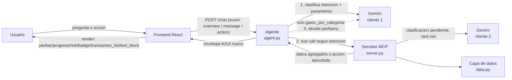

# Arquitectura — Asistente financiero (banca personal, educación financiera, pagos)

## Visión general

Un agente (LLM) interpreta la intención del usuario en una sola caja de
texto, decide cuál de cuatro pantallas armar, usa un servidor MCP para
obtener/agregar datos y ejecutar acciones, y responde con una interfaz
descrita en un protocolo propio tipo A2UI — nunca texto plano. El frontend
no decide nada de negocio: solo sabe pintar los tipos de componente que el
agente le manda, y cada interacción con esa UI (crear un límite de gasto)
regresa al agente y produce una pantalla nueva, cerrando el ciclo.



## Las tres piezas no negociables

1. **LLM al centro** (`backend/agent.py`): un router clasifica la intención
   del usuario (una de cuatro, ver abajo) y extrae los parámetros que
   necesita, en una sola llamada. El agente nunca clasifica transacciones
   ni hace aritmética de dinero — eso vive en la capa de datos, no en el
   prompt.
2. **MCP para datos y acciones** (`backend/mcp_server/`): el agente nunca
   toca una transacción directamente. Todo pasa por tools registradas en un
   servidor MCP (`obtener_gasto_por_categoria`, `obtener_diagnostico_financiero`,
   `obtener_proximos_pagos`, `obtener_limites_gasto`, `crear_limite_gasto`,
   `eliminar_limite_gasto`), wrappers finos sobre la capa de datos — sin
   lógica de negocio propia en el servidor.
3. **Protocolo de UI tipo A2UI**: el agente responde con un "envelope" JSON
   (`{version, intent, conversation_id, components, suggested_prompts}`)
   donde cada `component` tiene un `type` de un catálogo cerrado
   (`pie_chart`, `bar_chart`, `table`, `transaction_list`, `text_block`,
   `progress`, `risk_indicator`, `category_badge`, `action_button`). El
   frontend resuelve `type` contra un registry de componentes React —
   agregar un componente nuevo no requiere cambiar el contrato, solo
   registrar el nuevo `type`.

## Las cuatro intenciones

Una sola caja de texto, cuatro pantallas posibles — la UI cambia porque el
agente interpretó la intención, no porque el usuario navegó a otro lado.

| Intención | Pregunta de ejemplo | Qué arma | Llamadas a Gemini |
|---|---|---|---|
| `gasto_por_categoria` | "¿en qué gasté más este mes?" | `text_block` + `pie_chart`/`bar_chart`/`table` + `action_button` (si una categoría domina y no tiene límite) + aviso `risk_indicator` (si algún límite ya se excedió) | 2: router, y decidir la variante |
| `diagnostico_financiero` | "¿cómo voy este mes?" | `text_block` + `risk_indicator` + `category_badge` + `progress` + `action_button` (quitar límite, si existe) | 1: solo el router — el resto se compone en Python |
| `proximos_pagos` | "¿qué pagos tengo próximos?" | `text_block` + `transaction_list` | 1: solo el router |
| `fuera_de_alcance` | "cuéntame un chiste" | `text_block` + `suggested_prompts` | 1: solo el router |
| `event:"overview"` (abrir la app) | — | igual que `gasto_por_categoria`, mes actual | 1: se salta el router (ya se sabe la intención), pero sigue llamando a decidir UI |
| `event:"action"` (`crear_limite_gasto` / `eliminar_limite_gasto`) | botón en la UI | `text_block` (+ `progress` al crear) — pantalla nueva | 0 — puro MCP, ninguna llamada a Gemini |

El costo real es más bajo de lo que parece a primera vista: solo
`gasto_por_categoria`/`overview` cuestan 2 llamadas; diagnóstico, pagos y el
guardrail cuestan 1; las acciones no cuestan nada. Esto importa porque la
capa gratuita de Gemini da 20 solicitudes/día **por proyecto de Google
Cloud** (no por API key — varias keys del mismo proyecto comparten el mismo
cupo). El cruce contra límites guardados (para el aviso y para no sugerir
un límite duplicado) agrega una tool MCP más (`obtener_limites_gasto`) a
`gasto_por_categoria`/`overview` — sin costo de Gemini, solo una lectura de
disco adicional dentro del mismo proceso MCP.

## Flujo de una consulta, paso a paso

0. **El router clasifica la intención.** Una sola llamada a Gemini con
   salida JSON estructurada devuelve, a la vez, cuál de las cuatro
   intenciones es y los parámetros que necesita (para gasto/diagnóstico: el
   rango de fechas solicitado). Van juntos a propósito: separarlos subiría
   el costo por consulta de 1 a 2 llamadas para tres de las cuatro
   intenciones. Si la intención es `fuera_de_alcance`, el flujo termina
   aquí — nunca toca MCP.
1. El agente aplica un tope máximo de 3 meses hacia atrás **en código
   Python**, no confiando esa aritmética al LLM — evita que una
   interpretación creativa del modelo rompa la regla de negocio.
2. El agente llama la tool MCP que le toca a esa intención
   (`obtener_gasto_por_categoria`, `obtener_diagnostico_financiero`, u
   `obtener_proximos_pagos`) con el rango ya acotado. El servidor MCP:
   - Genera/trae las transacciones crudas del rango (hoy sintéticas,
     deterministas por fecha — ver "Capa de datos" abajo).
   - Excluye movimientos que no son gasto discrecional (retiros,
     transferencias, depósitos, comisiones) **antes** de clasificar — nunca
     cuentan como "Otros".
   - Clasifica cada comercio único por capas (ver siguiente sección).
   - Agrega, compara contra el periodo anterior, o detecta recurrencia,
     según la tool (ver "Las cuatro intenciones" arriba).
3. Solo para `gasto_por_categoria`: el agente le pide a Gemini (segunda
   llamada, estructurada, sin la lista de transacciones para no gastar
   tokens) que decida la variante y escriba un mensaje breve. El criterio
   usa umbrales numéricos explícitos, no "a juicio libre" del modelo:
   `pie_chart` si una categoría se lleva ≥45% del total o dobla a la
   segunda, `table` si hay 4+ categorías sin que ninguna le saque más de 15
   puntos porcentuales a la siguiente (parejas y numerosas — ni pastel ni
   barras dejan comparar montos con precisión ahí), `bar_chart` en
   cualquier otro caso. Se encontró probando en vivo que un criterio vago
   ("si dominan claramente") caía en `pie_chart` casi siempre con este
   dataset sintético (Amazon/Liverpool, los comercios de Compras, tienen un
   rango de montos mucho más ancho que el resto) — el umbral numérico lo
   hace verificable y hace que el resultado varíe de verdad según el
   periodo. Las otras tres intenciones componen su `text_block` en Python,
   directo de los números que ya regresó la tool — cero llamadas extra.
4. El agente cruza el gasto contra los límites guardados
   (`obtener_limites_gasto`, sin costo de Gemini) y antepone un aviso
   (`risk_indicator`) si alguno ya se excedió — así se ve en cuanto se abre
   la app o se pregunta por el gasto, no solo si se pregunta "¿cómo voy?"
   con esas palabras exactas. Traduce el resultado a un envelope A2UI en
   inglés (el contrato interno de clasificación vive en español; la
   traducción pasa en esta frontera) y lo regresa al frontend.
5. El frontend renderiza. El click en una categoría expande sus
   transacciones **sin ninguna llamada de red nueva** — ya vinieron
   anidadas desde el paso 2. Es el punto más visible de una demo en vivo,
   así que es también el que menos debe depender de algo que pueda fallar.

## El ciclo cerrado: la acción real

Aparte de las consultas (de solo lectura), existen dos acciones que sí
modifican estado: crear y quitar un límite de gasto en una categoría (y
crear de nuevo sobre la misma categoría ya actúa como "editar", porque
`crear_limite_gasto` reemplaza el límite existente). Esto es lo que el
reto exige explícitamente — "cada interacción con la UI generada debe
volver al agente y producir nuevas acciones o una nueva interfaz", no basta
con generar una pantalla una vez.

1. Cuando responde `gasto_por_categoria`, si una categoría se lleva ≥30%
   del gasto y no tiene ya un límite guardado, el agente agrega un
   `action_button` sugiriendo uno nuevo (20% menos del gasto actual,
   redondeado a $50 — regla de negocio en Python, no decisión del LLM). Si
   ya tiene un límite y este se excedió, en vez de sugerir uno duplicado el
   aviso de riesgo (ver arriba) ya cubre esa señal.
2. El usuario pulsa el botón. El frontend manda
   `{event:"action", component_id, action_id, params}` al mismo `/chat`.
3. El agente ejecuta `crear_limite_gasto` o `eliminar_limite_gasto` vía
   MCP — sin ninguna llamada a Gemini, es una escritura directa a la capa
   de datos (persistida en disco).
4. El agente responde con **una pantalla nueva**: al crear, confirmación +
   `progress` mostrando el gasto real de esa categoría contra el límite
   recién creado; al quitar, confirmación de que ya no hay límite guardado
   — nunca un `alert`, nunca un toast.
5. La próxima vez que el usuario pregunte "¿cómo voy?", el diagnóstico ya
   refleja ese límite (o su ausencia) — y desde esa misma pantalla, si hay
   un límite guardado en la categoría de mayor gasto, aparece el botón
   para quitarlo. Crear → ver el efecto → ajustar o quitar es el mismo
   ciclo, no tres features distintas.

Ese encadenamiento (intención → UI → acción → UI nueva → contexto para la
siguiente intención) es el momento a demostrar en vivo.

## Clasificación por capas

En vez de mandar cada transacción al LLM, la clasificación se resuelve en
capas, de más barata/rápida a más cara:

```
comercio → ¿diccionario de cadenas conocidas? ──sí──► categoría
              │no
              ▼
         ¿palabra genérica del nombre del negocio? ──sí──► categoría
              │no
              ▼
         ¿ya está en caché de corridas anteriores? ──sí──► categoría
              │no
              ▼
         batch a Gemini (una sola llamada con TODOS
         los conceptos pendientes, nunca uno por transacción)
              │
              ▼
         ¿categoría válida en la respuesta? ──sí──► categoría (se cachea)
              │no
              ▼
         "Otros" (red de seguridad final)
```

- **Diccionario de cadenas conocidas**: comercios enumerables por nombre
  exacto (Walmart → Despensa, Netflix → Entretenimiento/Suscripciones).
- **Palabras genéricas**: substrings que indican el tipo de negocio
  ("TAQUERIA", "FARMACIA", "CONSULTORIO") — cubren comercios independientes
  no enumerables, mientras su nombre incluya una palabra reveladora.
- **Caché persistente** (JSON en disco): una vez resuelto un comercio por
  el LLM, nunca se le vuelve a preguntar.
- **Fallback a LLM**: solo para lo que de verdad lo necesita — negocios
  independientes con nombres 100% estilizados, sin ninguna palabra
  genérica. Con el dataset sintético actual, el diccionario + palabras
  genéricas cubren el 100% de los comercios — el fallback existe para
  datos reales, no porque el dataset de demo lo necesite.
- **"Otros"**: red de seguridad si el LLM no resuelve o devuelve algo fuera
  de las categorías válidas.

Esto minimiza costo, latencia, y puntos de falla: la herramienta cara (el
LLM) solo se usa donde realmente generaliza algo que un diccionario no
puede.

## Diagnóstico financiero: nivel de riesgo determinista

`obtener_diagnostico_financiero` compara el periodo pedido contra el
periodo inmediato anterior de la misma duración, y evalúa los límites
guardados contra el gasto real. El nivel de riesgo (`low`/`medium`/`high`)
es una regla de negocio en Python, **no una decisión del LLM**:

- `high`: algún límite excedido, o variación de gasto > +25%.
- `medium`: algún límite ≥80% usado, o variación > +10%.
- `low`: cualquier otro caso.

Que sea determinista importa por dos razones: es testeable con pytest sin
red ni Gemini de por medio, y el texto del `risk_indicator`/`text_block` se
redacta en Python a partir de esos números — cero llamadas extra a Gemini
sobre lo que ya cuesta el router.

## Próximos pagos: detección de recurrencia, y su límite honesto

`obtener_proximos_pagos` busca, en los últimos 3 meses, comercios que
aparecen en al menos 2 meses distintos con montos parecidos (dispersión
≤80% del promedio), y proyecta la siguiente fecha (mismo día del mes,
recortado si ese mes es más corto) y el monto estimado.

Esa regla sola no alcanza: con la densidad del dataset sintético, casi
cualquier comercio cae en 2 de 3 meses por puro azar, y una tienda a la que
simplemente vuelves seguido (ej. Starbucks) tiene una firma estadística
—monto angosto, aparece cada mes— indistinguible de una suscripción real
(ej. Spotify). Por eso se agrega un filtro adicional, previo a la
estadística: **la categoría del comercio debe ser una de gasto recurrente
por definición** (`Servicios`, `Entretenimiento/Suscripciones`) — mismo
principio que el diccionario de clasificación, usar lo que ya se sabe del
dominio en vez de solo inferir de los montos. Esto excluye de raíz a
Despensa, Comida, Compras, Transporte y Salud, que son gasto variable por
naturaleza.

Con el dataset de la demo, esto baja el resultado de ~10 comercios
(mezclando Walmart, tacos, pizza con Netflix/Spotify) a los 2-3 genuinos.
No es una solución perfecta — sigue siendo una heurística, no hay ninguna
señal explícita de "esto es una suscripción" en los datos — pero es honesta
sobre sus límites y barata de razonar si un juez pregunta por qué algo sí o
no aparece en la lista.

## Por qué dos clientes de Gemini, no uno

El agente (`agent.py`) y el servidor MCP (`server.py`) son **procesos
separados**, conectados por MCP sobre stdio — el protocolo solo pasa
argumentos serializables entre ellos, no funciones de Python. La función de
clasificación por LLM (`llm_classify_fn`) se inyecta en la capa de
clasificación, pero tiene que construirse **dentro del proceso que la
ejecuta** — que es el servidor MCP, no el agente. Por eso hay dos clientes
de Gemini independientes, cada uno con su propia llamada estructurada:

- `agent.py`: resuelve el periodo en lenguaje natural y decide el tipo de
  componente de UI.
- `server.py`: resuelve comercios que el diccionario no cubre.

No es duplicación accidental — es consecuencia directa de que MCP separa
procesos, y cada proceso que necesita al LLM se lo pide por su cuenta.

## Capa de datos aislada y reemplazable

El proyecto no tiene acceso a una API real de Banorte ni tiempo para
integrar un proveedor de Open Finance (Belvo, Finerio) en el tiempo de un
hackathon. En vez de fingir una conexión real, la arquitectura es honesta
sobre esto y queda lista para el cambio: toda la fuente de datos vive en
un solo módulo (`mcp_server/data.py`) que expone tres funciones
(`obtener_transacciones`, `crear_limite_gasto`, `obtener_limites_gasto`) —
el resto del sistema no sabe ni le importa si los datos son sintéticos o
reales. Cambiar a una API
real el día de mañana significa reescribir un archivo, no el sistema.

Las transacciones sintéticas se generan de forma **determinista** (semilla
fija por fecha): la misma fecha siempre produce las mismas transacciones,
así que los datos no quedan obsoletos ni hay que persistirlos — siempre
reflejan la ventana móvil de hasta 3 meses hacia atrás desde "hoy". Los
límites de gasto sí se persisten (JSON en disco), porque son estado real
creado por el usuario.

## Decisiones técnicas y trade-offs

| Decisión | Alternativa considerada | Por qué esta |
|---|---|---|
| Python en todo el backend | Node/TypeScript | SDKs de MCP y Gemini más maduros en Python; consistente con el servidor MCP. |
| `mcp.server.fastmcp.FastMCP` (SDK oficial) | Paquete `fastmcp` de terceros | El SDK oficial ya estaba validado como viable; el cliente de `fastmcp` requiere una versión de `mcp` incompatible con el servidor elegido. |
| Function calling manual (el agente llama la tool MCP directo, con salida JSON estructurada para decisiones) | Soporte "automático" de Gemini para pasar una sesión MCP completa como tool | El modo automático es experimental y sus detalles internos (cómo extraer el resultado crudo de la tool) no están bien documentados — más riesgo para una demo en vivo. |
| JSON en disco para caché/límites | SQLite | Simplicidad dado el tiempo disponible; no hay necesidad real de consultas relacionales. |
| Datos sintéticos, generados por el equipo | Integrar un proveedor de Open Finance real | No hubo acceso a una API real de Banorte ni tiempo de integrarlo; la capa de datos queda aislada para ese cambio futuro. |
| Drill-down de categoría 100% local en frontend (sin llamada de red) | Pedir las transacciones de una categoría al backend al hacer click | Reduce puntos de falla justo en el momento más visible de una demo en vivo; el costo es mandar todas las transacciones desde la respuesta inicial, aceptable al tamaño de este dataset. |
| Router de intención + parámetros en una sola llamada | Dos llamadas separadas (clasificar, luego extraer parámetros) | Tres de las cuatro intenciones solo necesitan esta llamada; separarla les subiría el costo de 1 a 2 llamadas por consulta, y la cuota gratuita es una restricción real. |
| `diagnostico_financiero`/`proximos_pagos` responden en texto compuesto en Python | Pedirle a Gemini que redacte el mensaje también | El texto sale de números ya calculados (variación, nivel de riesgo, montos) — no hay nada que el LLM "interprete" ahí que Python no pueda componer directo, y ahorra una llamada por consulta. |
| `proximos_pagos` restringido a categorías Servicios/Entretenimiento | Solo la heurística estadística (recurrencia + monto parecido) | La heurística sola no distingue una suscripción real de una tienda a la que se vuelve seguido (ver sección de arriba) — la categoría es una señal barata que sí lo hace. |
| Un solo endpoint `/chat` con campo `event` | Dos endpoints separados (`/chat` consulta, `/action` acción) | El frontend ya lo construyó y probó así; es la misma información, solo que en el body en vez de la ruta — adoptarlo evitó pedir un cambio innecesario del otro lado. `POST /action` se eliminó una vez que `event:"action"` quedó conectado. |

## Qué no es real todavía (alcance deliberado)

- **`proximos_pagos` sigue siendo una heurística, no ciencia exacta.** El
  filtro de categoría (ver arriba) redujo mucho los falsos positivos, pero
  no hay ninguna señal explícita de "esto es una suscripción" en los datos
  — sigue siendo posible que algo se cuele o falte.
- **La cuota de Gemini es del proyecto de Google Cloud, no de la API key**
  — tener varias keys del mismo proyecto no aumenta el límite real. La
  mitigación de fondo (habilitar facturación, o usar keys de proyectos
  distintos) es una decisión de infraestructura pendiente del equipo, no
  del código.
- No hay autenticación ni CORS restringido a un origen específico — alcance
  de demo, sin datos sensibles reales.
- No hay memoria de conversación entre preguntas: cada mensaje se rutea
  solo, sin contexto de lo que se preguntó antes. Una pregunta de
  seguimiento que dependa de la respuesta anterior (ej. "¿y solo en esa
  categoría?") no se interpreta como continuación, se vuelve a rutear desde
  cero.
- **El aviso de límite excedido es reactivo, no una notificación real.**
  Aparece en cuanto el usuario abre la app o pregunta algo — pero si nunca
  vuelve a abrirla, no se entera. No hay push/email/SMS: eso es
  infraestructura nueva, fuera del alcance de este reto (LLM + MCP + A2UI),
  y una decisión consciente de no perseguir a horas de la presentación.
